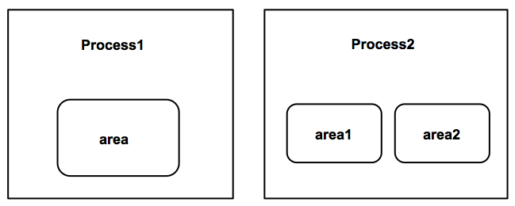
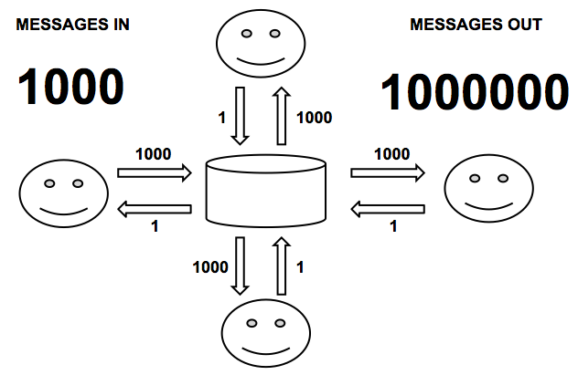
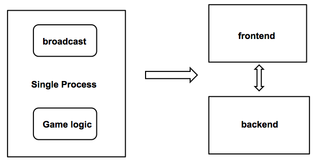
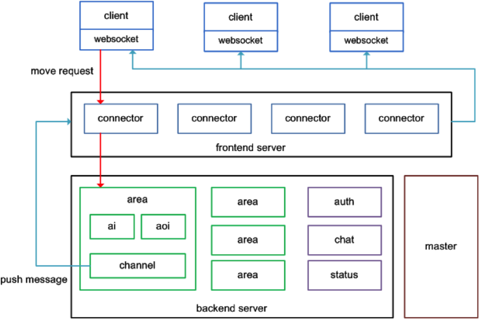

#深入浅出node.js游戏服务器开发1---基础架构与框架介绍

本系列文章将分别介绍用node.js进行游戏服务器开发、游戏的基础架构、游戏服务器框架pomelo、基础的游戏服务器开发，以及相关的一些开发策略和性能优化的内容。不使用node.js与pomelo开发游戏服务器或高实时web应用，也能从架构、思考和一些策略中有所获。

计划的系列文章：

* 基础架构与框架介绍
* pomelo架构概览
* 用pomelo搭建聊天服务器
* 完整游戏服务器的架构搭建
* 深入游戏服务器场景管理
* 场景管理相关策略---寻路与AOI
* 谈游戏服务器的相关策略--存储、AI
* node.js游戏服务器性能优化实践



##游戏服务器概述
没开发过游戏的人会觉得游戏服务器是很神秘的东西。但事实上它并不比web服务器复杂，无非是给客户端提供网络请求服务，本质上它只是基于长连接的socket服务器。当然在逻辑复杂性、消息量、实时性方面有更高的要求。


###游戏服务器是复杂的socket服务器。
如果说web服务器的本质是http服务器，那么游戏服务器的本质就是socket服务器。
它利用socket通讯来实现服务器与客户端之间的交互。事实上有不少游戏是直接基于原生socket来开发的。
相对于简单的socket服务器，它承受着更加烦重的任务：

* 后端承载着极复杂的游戏逻辑。
* 网络流量与消息量巨大，且实时性要求极高。
* 通常一台socket服务器无法支撑复杂的游戏逻辑，因此在socket服务器的背后还有一个服务器群。

###为什么纯粹的socket服务器还不够好？
很多web应用不会基于原生的http服务器搭建，一般都会基于某类应用服务器（如tomcat）搭建，而且还会利用一些开发框架来简化web开发。
同样，一般游戏服务器的开发都会在socket服务器上封装出一套框架或类似的应用服务器。为什么使用原生的socket接口开发不够好呢?

* 抽象程度。原生的socket抽象程度过低，接口过于底层，很多机制都需要自己封装，如Session、filter、请求抽象、广播等机制都要自已实现，工作量很大，容易出错，且有很多的重复劳动。
* 可伸缩性。高可伸缩性需考虑很多问题，消息密度、存储策略、进程架构等因素都需要考虑。用原生的socket要达到高可伸缩性，需要在架构上花费大量的功夫，而且效果也未必能达到开源框架的水准。
* 服务端的监控、管理。很多服务器的数据需要监控，例如消息密度、在线人数、机器压力、网络压力等，如果采用原生socket，所有这些都要自己开发，代价很大。

###用框架来简化游戏服务器开发
一个好的框架可以大大简化游戏服务器的工作。除了游戏自身的逻辑外，大部分的工作都可以用框架来解决。服务端的抽象，可伸缩性，可扩展性这些问题都可以通过框架来解决。
游戏服务器框架也承担了应用服务器的功能。可以把框架看成容器，只要把符合容器标准的代码扔进去，容器就运行起来了。它自然具备了抽象能力、可伸缩性和监控、管理等能力。



## 游戏服务器框架介绍
在开源社区里充斥了数不清的web服务器框架，游戏客户端的框架和库也有一大堆，但唯独游戏服务器框架少之又少，零星有一些类库，但完整的解决方案几乎没有。我们只好从商用的解决方案中拿出一些框架进行类比：
###[Sun RedDwarf](http://www.reddwarfserver.org)
RedDwarf是唯一一个能找到的完整的开源游戏服务器框架，由sun出品。可惜在它合并到Oracle以后已经停止开发了。
在设计上，RedDwarf是个分布式架构，它在分布式数据存储和任务管理上投入了太多精力，而且做的过于理想化，如动态任务迁移功能的实现非常复杂，但实际应用中根本用不到。而在可伸缩性和性能的设计上不太理想。因此RedDwarf夭折了。

###[SmartfoxServer](http://www.smartfoxserver.com/)
SmartfoxServer是由意大利的一家游戏公司gotoAndPlay()推出的商用游戏服务器。
它是基于java开发的，与web应用服务器如Tomcat看上去很类似。Smartfox支持各种客户端，且有一些成功案例。它在服务端封装和监控管理方面实现得很完善。
但在可伸缩性上并不是太理想，尽管Smartfox也支持Cluster模式，但它的扩展方式是基于jvm内存复制的。也没有实现传统MMORPG基于场景分区的解决方案。
Smartfox有免费版本，但完全不开源。而且它的免费版本(达不到高并发用户要求)很大程度是为了吸引开发者最终购买它的收费版本。不限在线人数的收费版本价格达到3500美刀。

###[BigWorld](http://www.bigworldtech.com/zh/)
Bigworld是澳大利亚Bigworld公司开发的全套3d MMORPG游戏解决方案，解决方案包含了客户端和服务端。Bigworld功能非常强大，在动态负载均衡和容错性做了很多工作。可扩展性非常强大。
它的缺点是过于重量级，对硬件要求高，且价格非常昂贵。Bigworld是专门为3d MMORPG游戏定制，但并不适用于中小型游戏的开发。


###[Pomelo](http://pomelo.netease.com)
Pomelo是网易于2012年11月推出的开源游戏服务器。它是基于node.js开发的高性能、可伸缩、轻量级游戏服务器框架。
它的主要优势有以下几点：


* 开发模型快速、易上手，基于Convention over configuration的原则，让代码达到最大的简化。
* 架构的可伸缩性和可扩展性好，pomelo在服务器扩展和应用扩展上实现得非常方便。
* 轻量级，虽然是分布式架构，但启动非常迅速，占用资源少。
* 参考全面，框架不仅提供了完整的中英文档，还提供了完整的MMO demo代码(客户端html5)，可以作为很好的开发参考。

Pomelo目前的主要缺点是推出时间尚短，一些功能还在完善中，支持的客户端类型还有限，目前已支持HTML5、ios、android、untiy3d等4类客户端，未来还会支持更多的客户端类型。


##游戏服务器的可伸缩性探讨
不管是web应用还是游戏服务器，可伸缩性始终是最重要的指标，也是最棘手的问题，它涉及到系统运行架构的搭建，各种优化策略。
只有把可伸缩性设计好了，游戏的规模、同时在线人数、响应时间等参数才能得到保证。

###为什么游戏服务器的可伸缩性远远不及web?
相比web应用几乎无限扩展的架构（前提是架构设计得好），游戏服务器的可伸缩性相比就着差远了。那么是哪些因素导致游戏无法达到web应用的扩展能力呢？
说明：本文提到的web应用不包括类似于聊天这样的高实时web应用，高实时web可认为是一种逻辑较简单的游戏。


####长连接和响应实时性
web应用都是基于request/response的短连接模式。占用的资源要比一直hold长连接的游戏服务器要少很多。Web应用能使用短连接模式的原因如下：


* 通讯的单向性，普通web应用一般只有拉模式
* 响应的实时性要求不高，一般web应用的响应时间在3秒以内都算响应比较及时的。

而游戏应用只能使用长连接，原因如下：

* 通讯的双向性，游戏应用不仅仅是推拉模式，而且推送的数据量要远远大于拉的数据量
* 响应的实时性要求极高，一般游戏应用要求推送的消息实时反映，而实时响应的最大时间是100ms。

在高并发长连接服务的解决方案中，目前除了传统的C语言（过于重量级）实现，用的最多的是erlang与node.js。两者的性能指标差不多，而node.js在易用性方面毫无疑问胜出太多。

最近微博上看到时go的能撑起100万的并发连接，node.js也能达到同样的数据， [Node.js w/1M concurrent connections!](http://blog.caustik.com/2012/08/19/node-js-w1m-concurrent-connections/)有node.js的长连接数据，它占用了16G内存，但CPU还远没跑满。

####交互的相邻性与分区策略
普通的web应用在交互上没有相邻性的概念，所有用户之间的交互都是平等，交互频率也不受地域限制。
而游戏则不然，游戏交互跟玩家所在地图（场景）上的位置关系非常大，如两个玩家在相邻的地方可以互相PK或组队打怪。这种相邻的交互频率非常高，对实时性的要求也非常高，这就必须要求相邻玩家在分布在同一个进程里。
于是就有了按场景分区的策略，如图所示：
 


一个进程里可以有一个场景，也可以有多个场景。这种实现带来了以下问题：


* 游戏的可伸缩性受到场景进程的限制，如果某个场景过于烦忙可能会把进程撑爆，也就把整个游戏撑爆。
* 场景服务器是有状态的，每个用户请求必须发回原来的场景服务器。服务器的有状态带来一系列的问题：场景进程的可伸缩，高可用性等都比不上web服务器。目前只能通过游戏服务器的隔离来缓解这些问题。


####广播


游戏中广播的代价是非常大的。玩家的输入与输出是不对等的，玩家自己简单地动一下，就需要将这个消息实时推送给所有看到这个玩家的其他玩家。
假如场景里面人较少，广播发送的消息数还不多，但如果人数达到很密集的程度，则广播的频度将呈平方级增长。如图所示：


 

假如场景中1000个玩家，每人发1条消息，如果需要其它玩家都看到的话，消息的推送量将高达1,000,000条，这足以把任何服务器撑爆。

解决这个问题的方案：


* 减少消息数量---消息只发送给能看到的玩家。玩家能看到的只是屏幕的大小，而不是整张地图的大小，这样推送消息的时候可以只推给对自己的状态感兴趣的玩家。这个可以用AOI（area of interested）算法来实现，在pomelo的库pomelo-aoi中实现了简单的灯塔算法。
* 分担负载，将消息推送的进程与具体的逻辑进程分离。如图：




 
这样广播逻辑与具体的进程逻辑就不会相互影响了，而且由于只有后端的场景服务器是有状态的，前端负责广播的服务器还是无状态的，因此前端服务器可以无限扩展。

####实时Tick


实时游戏的服务端一般都需要一个定时tick来执行定时任务，为了游戏的实时性，一般要求这个tick时间在100ms之内。这些任务包括以下逻辑:


* 遍历场景中的实体(包括玩家、怪物等)，进行定时操作，如移动、复活、消失等逻辑。
* 定期补充场景中被杀掉的怪的数量。
* 定期执行AI操作，如怪物的攻击、逃跑等逻辑。

由于实时100ms的限制，这个实时tick的执行时间必须要远少于100ms，因此单进程内很多数据都会受到限制。


* 场景内实体的数量受限制，因为要遍历所有实体
* 注意更新的算法，所有的算法，包括AI在内都要在几十毫秒全部完成
* 注意GC，full GC最好永远不要发生。一般full GC的时间都会高于100ms，幸好node.js在内存少于500M时表现良好，只有小GC。因此一定要控制内存大小。
* 尽量分进程，进程的粒度越少，出现tick超时或full GC的可能越少。在多核时代里，CPU是最廉价的资源。

### 高可伸缩的运行架构
经过以上这些分析。我们可以得到现在的运行架构，如下图：



 

运行架构说明：


* 客户端通过websocket长连接连到connector服务器群。
* connector负责承载连接，并把请求转发到后端的服务器群。
* 后端的服务器群主要包括按场景分区的场景服务器(area)、聊天服务器(chat)和状态服务器等(status)，这些服务器负责各自的业务逻辑。真实的案例中还会有各种其它类型的服务器。
* 后端服务器处理完逻辑后把结果返回给connector，再由connector广播回给客户端。
master负责统一管理这些服务器，包括各服务器的启动、监控和关闭等功能。

这个运行架构符合了刚才提到的几个伸缩性原则：


* 前后端进程分离，把承载连接和广播的压力尽量分出去。
* 进程的粒度尽量小，把功能细分到各个服务器
* 按场景分区

前面提到4个游戏服务器框架，只有bigworld和pomelo符合这样的架构，当然bigworld实现的还要更复杂。
现在的问题是，这个运行架构是个分布式架构，而且并不简单，那就带来以下问题：


* 需要多少的代码来实现这样的运行架构？
* 服务器类型、数量管理和扩展有点复杂，该怎么管理？
* 服务器之间会有一堆的相互rpc调用，实现起来怎么简化？
* 分布式的开发和调试并不容易，消耗资源量过大，过于重量级，多进程bug定位困难，该怎么解决？
Pomelo和node.js将很轻松地帮我们解决这些难题，我们下一节将讨论。


##node.js、pomelo与游戏服务器

Node.js的特点与游戏服务器极其符合。列举如下:


* 对网络IO的处理能力，node.js生来就是为IO而生的，而游戏服务器刚好是网络密集型的应用。
* 单线程的应用模型，node.js的单线程处理能力远比其它语言强大，而单线程处理游戏逻辑是最简单，最不容易出错，而且还可能出现死锁、锁竞争的情况。
* 语言与轻量的开发模型。Javascript语言已经不是昔日的吴下阿蒙，它不仅由于脚本语言的轻量、简单带来了开发效率的提升。还可以与一些类型的客户端共享部分代码，如html5，unity3d的js客户端等。
* 语言的动态性带来了很多框架设计的便利，如设计DSL，实现Convention over configuration。尽管这方面比ruby稍差，但在pomelo框架中使用已经足够好了。

Pomelo是基于node.js搭建的游戏服务器框架，它在灵活性、扩展能力，轻量级调试方面具有无可比拟的优势。我们先简单回答第三章最末的几个问题：


* 用pomelo来实现以上的运行架构几乎是零代码的，因为它在设计时天生就具备这样的架构。
* 服务器类型、数量的管理极简单，利用鸭子类型、目录定义，只要一个简单json配置文件就可以实现所有服务器的管理。
* rpc调用可以实现完全零配置，也不用生成stub。感谢js语言的动态性，基于Convention over configuration的原则，可以直接实现rpc调用。
* 分布式的开发和调试只占用很少的资源，启动极其迅速，十几个进程只用10秒不到的时间完全启动。多进程调试与单进程调试没有任何区别，只在一个console里搞定。

在本系列文章后面将会陆续讨论pomelo是怎么实现以上如此方便的特性， 以及这些设计带来的启发。


## 小结
本文分析了游戏服务器框架的市场现状，一个高可伸缩游戏服务器架构的设计原则及运行架构。Node.js与pomelo在解决高并发和分布式架构中起到的作用。下文我们将深入分析pomelo在解决复杂的游戏服务器运行架构中提供了哪些便利。

