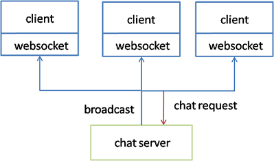
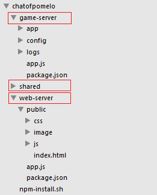
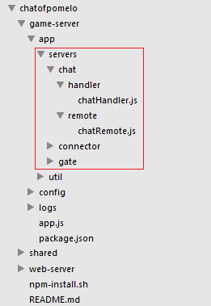
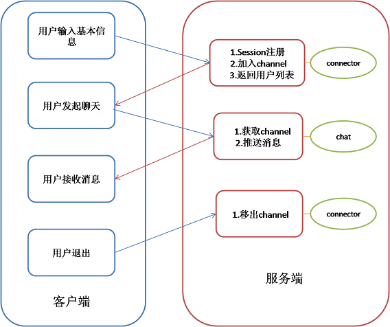
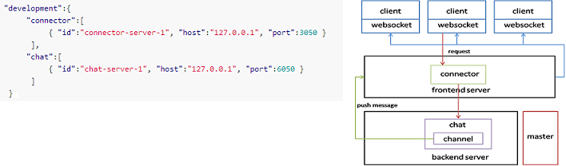
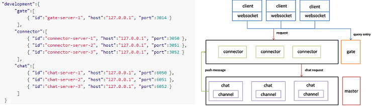

#深入浅出node.js游戏服务器开发--分布式聊天服务器搭建

在上一篇文章中， 我们介绍了游戏服务器的基本架构，相关框架和node.js开发游戏服务器的优势。本文我们将通过聊天服务器的设计与开发，来更深入地理解pomelo开发应用的基本流程、开发思路与相关的概念。本文并不是开发聊天服务器的tutorial，如果需要tutorial和源码可以看文章最后的参考资料。


##为什么是聊天服务器?


###我们目标是搭建游戏服务器，为什么从聊天开始呢？

聊天可认为是简化的实时游戏，它与游戏服务器有着很多共通之处，如实时性、频道、广播等。由于游戏在场景管理、客户端动画等方面有一定的复杂性，并不适合作为pomelo的入门应用。聊天应用通常是node.js入门接触的第一个应用，因此更适合做入门教程。

Pomelo是游戏服务器框架，本质上也是高实时、可扩展、多进程的应用框架。除了在library中有一部分游戏专用的库，其余部分框架完全可用于开发高实时web应用。而且与现在有的node.js高实时应用框架如derby、socketstream、meteor等比起来有更好的可伸缩性。

对于大多数开发者而言，node.js的入门应用都是一个基于socket.io开发的普通聊天室， 由于它是基于单进程的node.js开发的， 在可扩展性上打了一定折扣。例如要扩展到类似irc那样的多频道聊天室， 频道数量的增多必然会导致单进程的node.js支撑不住。

而基于pomelo框架开发的聊天应用天生就是多进程的，可以非常容易地扩展服务器类型和数量。

###从单进程到多进程，从socket.io到pomelo
一个基于socket.io的原生聊天室应用架构， 以[uberchat] (http://github.com/joshmarshall/uberchat )为例。 

它的应用架构如下图所示：


 

服务端由单个node.js进程组成的chat server来接收websocket请求。


它有以下缺点：

1. 可扩展性差：只支持单进程的node.js， 无法根据room/channel分区， 也无法将广播的压力与处理逻辑的压力分开。

2. 代码量大：基于socket.io做了简单封装，服务端就写了约430行代码。


用pomelo来写这个框架可完全克服以上缺点，并且代码量只要区区100多行。

我们要搭建的pomelo聊天室具有如下的运行架构：

 

在这个架构里， 前端服务器也就是connector专门负责承载连接， 后端的聊天服务器则是处理具体逻辑的地方。
这样扩展的运行架构具有如下优势：
* 负载分离：这种架构将承载连接的逻辑与后端的业务处理逻辑完全分离，这样做是非常必要的， 尤其是广播密集型应用（例如游戏和聊天）。密集的广播与网络通讯会占掉大量的资源，经过分离后业务逻辑的处理能力就不再受广播的影响。

* 切换简便：因为有了前、后端两层的架构，用户可以任意切换频道或房间都不需要重连前端的websocket。

* 扩展性好：用户数的扩展可以通过增加connector进程的数量来支撑。频道的扩展可以通过哈希等算法负载均衡到多台聊天服务器上。理论上这个架构可以实现频道和用户的无限扩展。


##聊天服务器开发架构

###game server与web server

聊天服务器项目中分生成了game-server目录、web-server目录与shared目录，如下图所示：



这样也将应用天然地隔离成了两个，game server与web server。

* Game server， 即游戏服务器，所有的游戏服务器逻辑都在里实现。客户端通过websocket（0.3版会支持tcp的socket）连到game server。game-server/app.js是游戏服务器的运行入口。
* Web server，即web服务器， 也可以认为是游戏服务器的一个web客户端， 所有客户端的js代码，web端的html、css资源都存放在这里，web服务端的用户登录、认证等功能也在这里实现。pomelo也提供了其它客户端，包括ios、android、unity3D等。
* Shared目录，假如客户端是web，由于服务端和客户端都是javascript写的，这时node.js的代码重用优势就体现出来了。shared目录下可以存放客户端、服务端共用的常量、算法。真正做到一遍代码， 前后端共用。


###服务器定义与应用目录
Game server才是游戏服务器的真正入口，游戏逻辑都在里， 我们简单看一下game-server的目录结构，如下图所示：




servers目录下所有子目录定义了各种类型的服务器，而每个servers目录下基本都包含了handler和remote两个目录。
这是pomelo的创新之处，用极简的配置实现游戏服务器的定义，后文会解释handler和remote。

通过pomelo，游戏开发者可以自由地定义自己的服务器类型，分配和管理进程资源。在pomelo中，根据服务器的职责不同，服务器主要分为前端服务器(frontend)和后端服务器(backend)两大类。其中，前端服务器负责承载客户端的连接和维护session信息，所有服务器与客户端的消息都会经过前端服务器；后端服务器负责接收前端服务器分发过来的请求，实现具体的游戏逻辑，并把消息回推给前端服务器，最后发送给客户端。如下图所示：


动态语言的面向对象有个基本概念叫鸭子类型。在pomelo中，服务器的抽象也同样可以比喻为鸭子，服务器的对外接口只有两类， 一类是接收客户端的请求， 叫做handler， 一类是接收RPC请求， 叫做remote， handler和remote的行为决定了服务器长什么样子。 因此开发者只需要定义好handler和remote两类的行为， 就可以确定这个服务器的类型。
例如chat服务器目前的行为只有两类，分别是定义在handler目录中的chatHandler.js，和定义在remote目录中的chatRemote.js。只要定义好这两个类的方法，聊天服务器的对外接口就确定了。


##搭建聊天服务器
###准备知识
####pomelo的客户端服务器通讯
pomelo的客户端和服务器之间的通讯可以分为三种：

* request-response

	pomelo中最常用的就是request-response模式，客户端发送请求，服务器异步响应。客户端的请求发送形式类似ajax类似:

 	```
    pomelo.request(url, msg, function(data){});
 	```

	第一个参数为请求地址，完整的请求地址主要包括三个部分：服务器类型、服务端相应的文件名及对应的方法名。第二个参数是消息体，消息体为json格式，第三个参数是回调函数，请求的响应将会把结果置入这个回调函数中返回给客户端。

* notify

	notify与request—response类似，唯一区别是客户端只负责发送消息到服务器，客户端不接收服务器的消息响应。

	```
	pomelo.notify(url, msg);
	```
	
* push

	push则是服务器主动向客户端进行消息推送，客户端根据路由信息进行消息区分，转发到后。通常游戏服务器都会发送大量的这类广播。

	```
	pomelo.on(route, function(data){});
	```
	
以上是javascript的api， 其它客户端的API基本与这个类型。由于API与ajax极其类似，所有web应用的开发者对此都不陌生。

####session介绍

与web服务器类似，session是游戏服务器存放用户会话的抽象。但与web不同，游戏服务器的session是基于长连接的， 一旦建立就一直保持。这反而比web中的session更直接，也更简单。 由于长连接的session不会web应用一样由于连接断开重连带来session复制之类的问题，简单地将session保存在前端服务器的内存中是明智的选择。

在pomelo中session也是key/value对象，其主要作用是维护当前用户信息，例如：用户的id，所连接的前端服务器id等。session由前端服务器维护，前端服务器在分发请求给后端服务器时，会复制session并连同请求一起发送。任何直接在session上的修改，只对本服务器进程生效，并不会影响到用户的全局状态信息。如需修改全局session里的状态信息，需要调用前端服务器提供的RPC服务。


####channel与广播
广播在游戏中是极其重要的，几乎大部分的消息都需要通过广播推送到客户端，再由客户端播放接收的消息。而channel则是服务器端向客户端进行消息广播的通道。
可以把channel看成一个用户id的容器.把用户id加入到channel中成为当中的一个成员，之后向channel推送消息，则该channel中所有的成员都会收到消息。channel只适用于服务器进程本地，即在服务器进程A创建的channel和在服务器进程B创建的channel是两个不同的channel，相互不影响。

####服务器之间RPC通讯
从之前的文章可以了解到，在pomelo中，游戏服务器其实是一个多进程相互协作的环境。各个进程之间通信，主要是通过底层统一的RPC框架来实现，服务器间的RPC调用也实现了零配置。具体RPC调用的代码如下：

	```javascript
	app.rpc.chat.chatRemote.add(session, uid, app.get('serverId'), function(data){});
	```

其中app是pomelo的应用对象，app.rpc表明了是前后台服务器的Remote rpc调用，后面的参数分别代表服务器的名称、对应的文件名称及方法名。为了实现这个rpc调用，则只需要在对应的chat/remote/中新建文件chatRemote.js，并实现add方法。


###聊天室流程概述

下图列出了聊天室进行聊天的完整流程：




通过以上流程， 我们可以看到pomelo的基本请求流程和用法。本文不是聊天室的tutorial，因此下面列出的代码不是完整的，而是用极简的代码来说明pomelo的使用流程和api。

###进入聊天室

客户端向前端服务器发起登录请求:

	```javascript
		pomelo.request('connector.entryHandler.enter', {user:userInfo}, function(){});
	```

用户进入聊天室后，服务器端首先需要完成用户的session注册同时绑定用户离开事件：

	```javascript
	session.bind(uid);
	session.on('closed', onUserLeave.bind(null, app));
	```

另外，服务器端需要通过调用rpc方法将用户加入到相应的channel中；同时在rpc方法中，服务器端需要将该用户的上线消息广播给其他用户，最后服务器端向客户端返回当前channel中的用户列表信息。

	```javascript
		app.rpc.chat.chatRemote.add(session, uid, serverId, function(){});
	```

###发起聊天
客户端向服务端发起聊天请求，请求消息包括聊天内容，发送者和发送目标信息。消息的接收者可以聊天室里所有的用户，也可以是某一特定用户。

服务器端根据客户端的发送的请求，进行不同形式的消息广播。如果发送目标是所有用户，服务器端首先会选择channel中的所有用户，然后向channel发送消息，最后前端服务器就会将消息分别发送给channel中取到的用户；如果发送目标只是某一特定用户，发送过程和之前完全一样，只是服务器端首先从channel中选择的只是一个用户，而不是所有用户。

	```javascript
	 	if(msg.target == '*') 
			channel.pushMessage(param);
		else
			channelService.pushMessageByUids(param,[{uid:uid, sid:sid}]);
	```

###接收聊天消息
客户端接收广播消息，并将消息并显示即可。

	```javascript
		pomelo.on('onChat', function() {
			addMessage(data.from, data.target, data.msg);
   			$("#chatHistory").show();
		});
	```

###退出聊天室
用户在退出聊天室时，必须完成一些清理工作。在session断开连接时，通过rpc调用将用户从channel中移除。在用户退出前，还需要将自己下线的消息广播给所有其他用户。

	```javascript
		app.rpc.chat.chatRemote.kick(session, uid, serverId, channelName, null);
	```
	

##聊天服务器的可伸缩性与扩展讨论
上一讲已经谈到pomelo在提供了一个高可伸缩性的运行架构，对于聊天服务器同样如此。如果想从单频道聊天室扩展到多频道聊天室，增加的代码几乎为零。大部分工作只是在进行服务器和路由的配置。对于服务器配置只需要修改json配置文件即可，而对于路由配置只需要增加一个路由算法即可。在pomelo中，开发者可以自己配置客户端到服务器的路由规则，这样会使得游戏开发更加灵活。

我们来看一下配置json文件对服务器运行架构的影响：

* 最简服务器与运行架构：



* 扩展后的服务器与运行架构：




另外，在0.3版本的pomelo中增加了动态增删服务器的功能，开发者可以在不停服务的情况下根据当前应用运行的负载情况添加新的服务器或者停止闲置的服务器，这样可以让服务器资源得到更充分的利用。


##总结
本文通过聊天服务器的搭建过程，分析了pomelo开发应用的基本流程，基本架构与相关概念。有了这些知识我们可以轻松地使用pomelo搭建高实时应用了。 在后文中我们将分析更复杂的游戏案例，并且会对架构中的一些实现深入剖析。

相关资源:

* [pomelo构建聊天服务器tutorial](https://github.com/NetEase/pomelo/wiki/tutorial1--%E5%88%86%E5%B8%83%E5%BC%8F%E8%81%8A%E5%A4%A9)
* [聊天服务器的源码](https://github.com/NetEase/chatofpomelo)
* [线上聊天服务器demo](http://pomelo.netease.com/chat)

