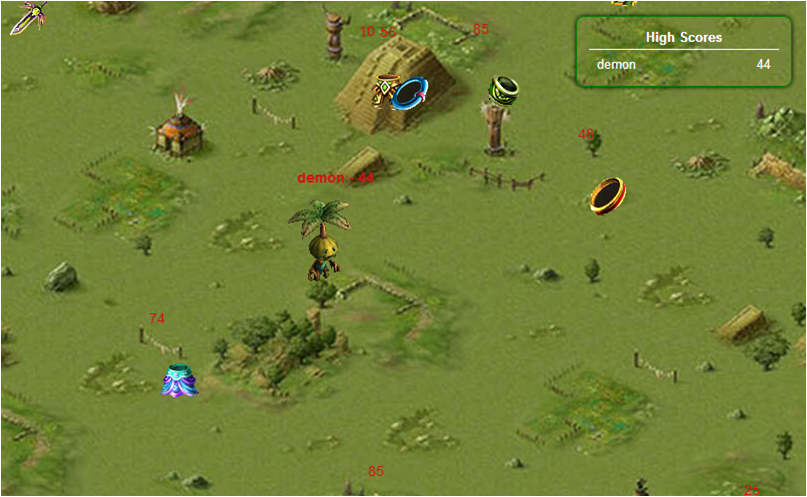
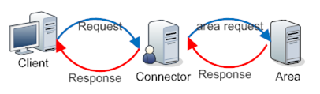
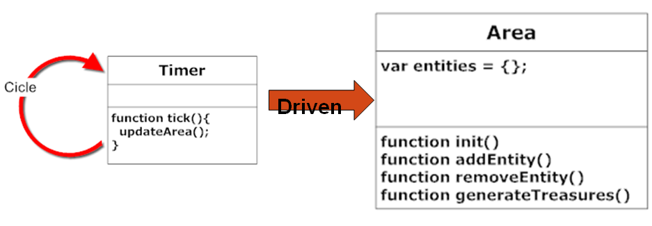
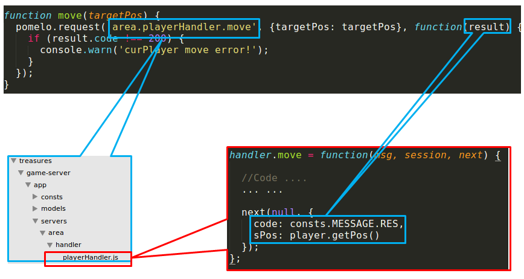
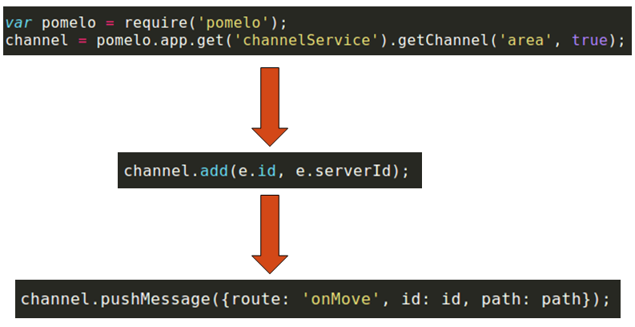
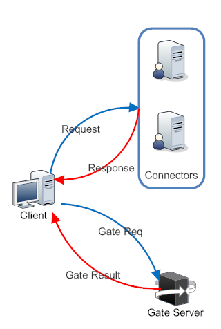
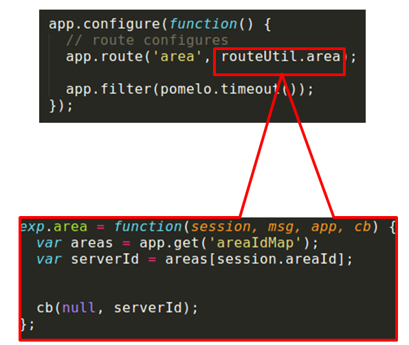
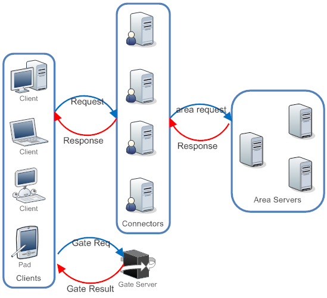

#深入浅出node.js游戏服务器开发3--基于Pomelo的MMO RPG开发

作者：张小刚 谢骋超

在上一篇文章中，我们介绍了如何使用Pomelo来搭建聊天服务器。在这篇文章中，我们为大家介绍如何使用Pomelo框架来搭建MMO RPG服务器，并分析其设计思路和实现方法。以此来帮助大家更好的理解和使用Pomelo框架，理解Pomelo框架游戏开发的基础流程，使用方法和设计理念。

本文中的游戏服务端架构，只是为了说明Pomelo的开发理念和设计思路，并不是基于Pomelo开发的唯一方案，开发者完全可以根据自己的实际应用环境设计不同的服务端架构。

##开始之前
###Pomelo框架与MMO RPG


我们曾在本系列[第一篇文章](http://www.infoq.com/cn/articles/game-server-development-1)介绍过pomelo的架构。我们先简单回顾一下Pomelo为我们的游戏开发提供了什么：


- 可扩展的服务器架构。Pomelo中对服务器端进行了抽象，将服务器分为承载链连接的前端服务器和负责业务逻辑的后端服务器，并提供了便利，高效的分布式扩展支持，让使用者可以在少改甚至不改的前提下实现对服务端的扩展。
- 完整的通信框架：Pomelo对客户端与服务器之间，服务器与服务器之间的通信进行了完整的封装。开发者只需要按照默认规则来填写服务代码就可以完成接口的发布和调用，而不用考虑内部实现。
- 大量游戏开发基础库：除了基本的服务器框架之外，Pomelo还提供了很多游戏开发需要用到的基础库，如任务调度，AI控制，寻路等，而这些库还会随着Pomelo的发展进一步完善。
- 基于Node.JS轻量级的开发环境，以及大量的模块。相对于传统的开发语言，Node.JS有着轻量，快捷的特性（0.3版中启动一个包括10几个服务器集成的服务端只需要不到4S）。而活跃的开源社区也提供了大量的第三方模块。

作为Pomelo游戏开发的入门导引，本文的重点将放在游戏基础架构的搭建上，因此本文将主要介绍下面三个方面的内容：游戏服务端的构建，与客户端的通讯，服务器的扩展。

###本文的参考示例
我们使用demo Treasures作为本文的参考示例，游戏的截图如下：



从上图可以看出，在treasures中，玩家会进入一张遍布宝物的地图中，通过拾取宝物来获得积分。所有玩家的积分在右上角会有一个排名。下面是这个demo的关键点：

- 每个玩家的行动对其他玩家来看都是实时的。
- 在获取宝物时积分会更新积分榜，这个更新对所有玩家实时可见。
- 宝物会定时刷新。

相对于一般的的MMO RPG，这个demo显得十分简陋：没有持久化，没有战斗，没有AI。。。但是，其中实现了MMO RPG中最核心的亮点功能：一个可以容纳多个在线玩家的游戏场景，以及玩家之间的实时互动。那些功能的确实可以让系统的结构更加清晰明确，成为一个非常好的项目导引。

##搭建游戏服务端
由于游戏逻辑十分简单，我们后端采用一台单独的场景服务器来运行整个游戏逻辑，同时加入一台连接服务器来承载用户连接，系统的设计如下：



下面，我们就按照这个设计来搭建游戏服务端。

###编写场景服务
游戏场景是玩家所处的虚拟环境，而场景服务器就是游戏场景在服务端的抽象，根据游戏类型和内容的不同，场景服务器的复杂程度也会千差万别。在我们的例子中，场景的构成十分简单：一张开放的游戏地图，地图中的玩家，以及定时刷新的宝物。

首先，作为一个场景服务器，需要能够储存用户和宝物的信息，这里我们直接使用一个放在内存中的map来储存场景中的所有实体，同时，我们将所有场景中的实体都抽象为一个Entity对象，放在这个map中。

为了能够操纵这些数据，还需要暴露出对外接口，我们使用的接口有下面三种：


- 初始化的接口:我们在init方法中会设置场景信息，配置参数等,并启动场景中的时钟循环。
- 实体访问接口：如AddEntity和RemoveEntity接口等，我们使用这些接口来访问和修改场景中的实体。
- 刷新场景中的宝物：当满足条件时，外部事件会调用该接口来刷新地图中的宝物。


我们通过一个无限循环的tick来驱动场景服务，在每一个tick中会更新场景中所有实体的状态信息，我们最终设计如下：



###搭建场景服务器
在完成场景服务的代码之后，我们还需要提供一个场景服务运行的平台，在Pomelo中，我们通过搭建一个场景服务器来实现。

Pomelo中的服务器分为两类，负责承载用户连接的前端服务器和运行逻辑的后端服务器。作为负责核心逻辑的场景服务器，自然是属于后端服务器，因此，我们在/game-sever/config/server.json中加入以下配置：

```
    "area": [
      {"id": "area-server-1", "host": "127.0.0.1", "port": 3250, "areaId": 1}
    ]
```

其中的“area”是我们为场景服务器类型所起的名称，其对应的内容就是场景服务器的列表，可以看出，现在我们只加入了单台场景服务器。与聊天服务器相比，场景服务器的配置并没有明显区别，只是多了一个areaId的属性。我们使用这一属性来标明这个场景服务器对应的场景id，我们的建议设计是**一个游戏服务器对应一个独立的游戏场景**，这样可以大大减少场景管理的开销，并提高单场景的负载能力。Pomelo中每一个服务器就是一个独立的进程，相对于一个场景服务的开销，单独的服务器造成的开销是可以接受的。当然，这只是建议设计，框架本身完全支持一个游戏服务器对应多个游戏场景的设计。开发者可以根据具体的应用情况调整场景服务器的配置，通过加入场景管理逻辑，实现一个场景服务器和场景之间的自由配置。

###启动场景服务
在加入场景服务器之后，我们还需要对服务端的运行环境进行配置，在场景服务器启动时运行对应的场景服务。为了实现这一目标，我们需要在app.js中加入如下配置：

```
	app.configure('production|development', 'area', function(){
	  var areaId = app.get('curServer').areaId;
	  area.init(dataApi.area.findById(areaId));
	});
```

app.configure方法用来对指定的服务器进行配置，包括三个参数，前两个参数分别是运行环境和服务器类型的filter，第三个参数是在满足前面两个filter的情况下需要运行的代码。在上面的配置中，第一个参数"production|development"表示是针对线上和开发两种环境，之后的‘area’参数表示的是针对area服务器类型。
关于app.js初始化的更多内容，见[Pomelo启动流程](https://github.com/NetEase/pomelo/wiki/pomelo%E5%90%AF%E5%8A%A8%E6%B5%81%E7%A8%8B)。

##与客户端通讯
###建立连接服务器
要与客户端通信，我们需要建立一个前端服务器，用来维护与客户端之间的连接。server.json中的配置如下:

```
	"connector": [
	  {"id": "connector-server-1", "host": "127.0.0.1", "port": 3150, "clientPort": 3010, "frontend": true}
	]
```
其中的标志位“frontend：true”表示这是一个前端服务器，“clientPort：3010”则表示该服务器对外暴露前端。对于前端服务器，在启动时就会默认加载连接组件，因此我们不需要在app.js中进行额外的配置。在pomelo 0.3中，如果需要使用原生websocket等非默认的连接方式，则需要在app.js中加入相应配置。在客户端，我们在启动时连接对应的接口，就可以建立起与服务端的连接。

###处理客户端请求
Pomelo中，我们提供了两种客户端向服务端发送请求的方法，request/response模式和notify模式。

request/response 模式与web中的请求模式相似，是标准的请求/响应模式，对于客户端的一个请求，服务端会给出一个响应。以玩家的移动为例，当需要移动时，会发送一个请求给服务端，服务端会验证客户端的请求，并返回结果客户端，下图是具体请求流程：



最上面的是客户端代码，在这里，我们向服务端发送一个移动请求。
之后，服务端会根据请求的route（area.playerHandler.move）找到对应的处理方法（/game-server/area/handler/playerHander.move），然后调用该方法来处理客户端的请求。当处理完成之后，会并在next方法中传入处理结果，结果会发回客户端，并作为回调函数的参数传回。

 notify模式的运行流程与request/response类似，只是当服务端处理请求后不会发送任何响应。客户端通过pomelo.notify方法来发出notify请求，notify请求的参数与pomelo.request相似，只是不需回调函数，notify方法的实例如下：
	    
	```
	pomelo.notify('area.playerHandler.pick', params);
	```

###服务端消息推送
与web服务不同，game服务端会有大量的推送消息，要实现这一功能，我们使用pomelo中的push模式来实现。下图以“move”为例，展示了服务端的推送流程：
	


Treasures中的广播功能是通过一个全局的channel来实现的，在游戏中的所有玩家在加入游戏后都会加入一个全局的channel中。当需要广播消失时，服务端就会调用这个全局的channel来对所有用户进行消息推送。

##扩展游戏服务端
在前面两节中，我们使用pomelo搭建了一个单节点的游戏服务器。在这一节中，将介绍如何使用Pomelo来对服务端进行扩展，搭建分布式的游戏服务。

由于游戏服务器的复杂性，像web服务器简单的水平扩展是不现实的，而根据业务逻辑的不同，不同的服务器也有着不同的扩展方案。因此我们分别以前面介绍的连接服务器和场景服务器为例，来对他们进行扩展。

###连接服务器的扩展
连接服务器作用是负责维护所有客户端的连接，负责客户端消息的接受和推送，在MMO RPG中，连接服务器往往是性能的热点之一，因此对连接服务器的扩展对于提高系统负载有很重要的现实意义。
在例子treasures中，我们通过加入一个负载均衡服务器（gate服务器），来实现连接服务器的扩展：当客户端登录时，会首先连接gate服务器，来分配一个连接服务器，之后，客户端会断开与gate服务器的连接，在与其对应的连接服务器建立连接，如下图所示：


要实现这一功能，在服务端，我们首先要在server.config中加入新的前端服务器，代码如下：

	```
    "gate": [
      {"id": "gate-server-1", "host": "127.0.0.1", "clientPort": 3014, "frontend": true}
    ]
	```

之后，在gate服务器上编写对应的负载均衡接口，在例子中，我们采用了使用uid的crc值对服务器数目取模的方式,代码如下:
	
	```
	module.exports.dispatch = function(uid, connectors) {
		var index = Math.abs(crc.crc32(uid)) % connectors.length;
		return connectors[index];
	};
	```

最后，在客户端加入对应的连接代码，就完成了对连接服务器的扩展。
在我们的例子中只用到了两台连接服务器，而在实际应用中，可以根据实际环境，编写自己的负载均衡算法，加入更多的连接服务器。

###场景服务器的扩展

与连接服务器不同，场景服务器中包含着大量的状态信息，如果对单一的场景进行扩展，需要复杂的同步机制和大量远程调用。因此，在Pomelo中，我们的场景扩展是通过加入新的场景来进行的。
在设计游戏时，整个世界就被分为多个不同的场景。而在服务器端，一个场景则与一个独立的场景服务器相对应，场景服务的扩展可以通过加入新的场景来完成。下面，就以treasure为例，介绍一下场景服务的的扩展方法：
因为场景扩展是通过加入新的场景来完成的，所以首先要在server.json中加入新的场景服务器：

在加入场景服务器之后，我们还要保证发往场景服务器的请求可以被分发到正确的场景去。而Pomelo中，对于同一类型的服务器，默认的分法方法是采用随机分配的方式，这是不能满足我们要求的。因此，我们需要加入自己的路由算法，流程如下：



首先，我们编写了新的路由算法：根据用户所属的场景id进行投递。之后，我们在app.js中使用app.route方法来将我们的路由算法配置为针对area服务器的默认方法。app.route方法接受两个参数，第一个是需要自定义route的服务器类型，第二个参数就是具体的路由算法。我们分别将‘area’服务类型和我们编写的算法传入，就可以实现自定义的路由功能了。

###跨平台客户端
除了原有的JS客户端之外，pomelo还提供了多种其他的客户端，而不同的客户端可能会对应着不同的长连接协议。但是经过pomelo封装之后，在Pomelo服务端，不同客户端在连接上连接上是完全对等的。因此，你可以使用pomelo框架实现跨平台联机对战的（前提是你开发了针对多个平台的游戏客户端）。

###最终架构
经过扩展后，我们的最终服务器架构如图所示：




##总结
在本文中，我们介绍了如何使用Pomelo框架来构建了一个包括连接服务器和场景服务器的MMO RPG服务端。并介绍了如何使用pomelo特性，来对游戏服务端进行扩展，并构建出了一个分布式的MMO RPG服务。
但是，这只是游戏服务端开发中最为基础的部分，MMO RPG中很多基础功能在这里都没有实现，如数据持久化，AI控制，寻路系统等。在下面的文章中，我们会进一步介绍Pomelo在游戏开发中的应用。

##参考示例
[捡宝demo](https://github.com/NetEase/treasures "捡宝demo")

[Pomelo启动流程](https://github.com/NetEase/pomelo/wiki/pomelo%E5%90%AF%E5%8A%A8%E6%B5%81%E7%A8%8B)

[Pomelo框架](https://github.com/NetEase/pomelo)
