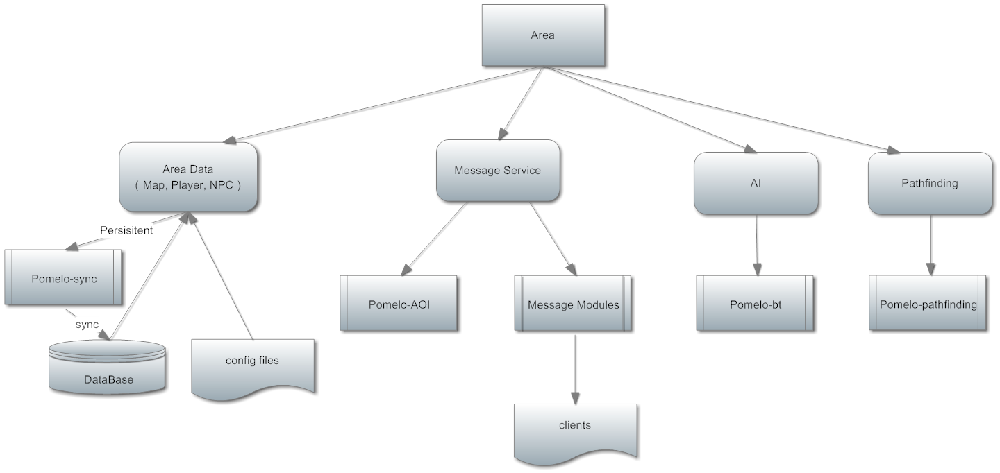
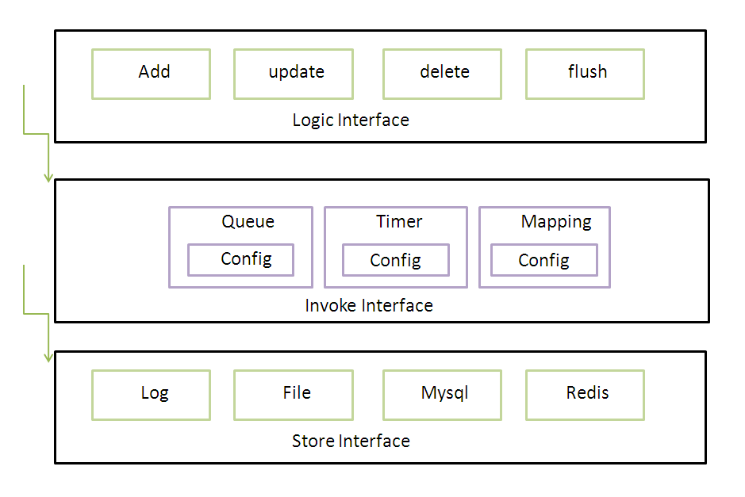
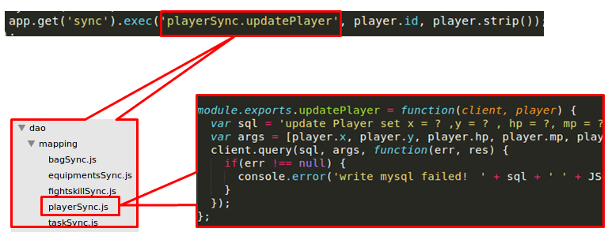
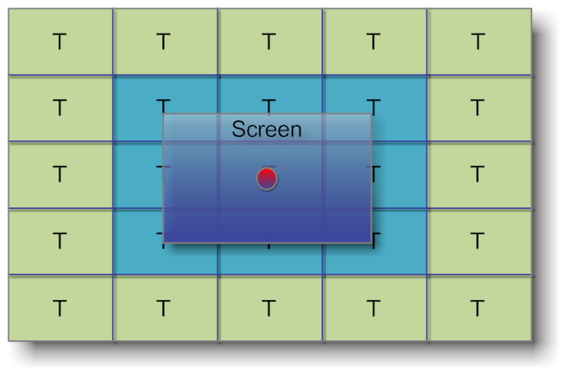

#场景服务分析
在上篇文章中，我们使用Pomelo框架搭建一个分布式的游戏服务器，并介绍了游戏服务中最基本的两项服务，场景服务和连接服务。在本文中，我们对场景服务进行进一步的剖析，为大家讲解游戏服务器的主要内容，以及Pomelo框架所提供的相关服务。

##游戏场景分析
在网络游戏中，玩家会在一个共同的世界中进行互动。根据具体游戏类型的不同，这个世界可能会千差万别，可以是qq游戏中的一个房间，或者是一张游戏地图，或者是3D游戏中的一个固定的区域。

由于一个游戏世界往往十分庞大，为了负载，扩展等原因，我们往往会把整个游戏世界划分为多个不同的区域进行管理，其中的每个区域就被称为一个场景。整个游戏世界就是有多个场景组成，这些场景之间主要会有两种不同的组合方式：

- 无缝组合：所有的游戏场景之间没有明显的界限，玩家可以在不同场景之间自由穿梭而不会有任何延时和停顿，就像在同一个巨大的场景中一样。在这种情况下，场景直接的整合和交互全部是由后台完成。实现这种架构需要负载的负载均衡机制和大量的RPC调用，在实现上较为复杂，对硬件负载也比较大。优点是方便灵活，可以方便的对某个场景的承载能力进行扩展，理论上可以做到‘无限大’的游戏场景。想商用的游戏框架bigworld就是使用这样的设计。

- 独立场景：整个游戏世界会分为不同的区域（一般是不同的游戏地图），不同区域之间的玩家之间是不可见的，无法进行直接的互动。这种做法的好处是架构简单，不需要远程调用和分布式事务处理。缺点是单场景承载能力有限，场景大小和承载人数取决于节点的运算能力。而负载的提高主要通过增加新的游戏场景来实现。

在Pomelo中，我们采用了第二种场景划分方式，不同的场景之间是相互分离的，不同场景的玩家之间一般不会进行直接交流。

在上一篇文章中我们实现了场景服务器，并为客户端提供了服务。但是，这个场景服务器是非常简单的，缺少很多基本功能。一个真正的场景服务，除了基本的tick和数据管理之外，还包括很多其他服务，下面，让我们以lordofpomelo为例，看一下场景服务中的基本内容：



从上图中可以看出，除了基本的实体管理功能外，场景服务还包括多种其他服务：

- 数据管理：负责维护场景中的所有数据，包括地图数据，玩家数据，NPC，怪物等。数据的来源可以是数据库或者配置文件。
- 消息服务：负责处理场景中的消息，并负责客户端的消息推送。比如用户请求的响应，发送广播消息等。
- AI模块： 负责场景中所有自动化事件，比如怪物行为的驱动，玩家自动化行为的控制等。
- 寻路服务：主要是负责地图中路径查询功能，即：给出地图中任意两点，根据地图信息计算出这两点之间的最短路径。

在本文中，我们将从之前介绍过的实体管理服务和数据服务出发，实现基于Pomelo-sync的数据持久化服务和基于Pomelo-AOI的广播服务。

##数据管理和持久化
在游戏场景中，有各种各样的数据：游戏地图数据，玩家数据，怪物数据，npc数据等。有的数据是静态不变的，如地图信息，怪物的配置，npc的位置等。而更多的数据则会随着用户操作（移动，攻击）和时间流逝而变化，而这些数据往往对玩家来说是非常重要的，因此就需要进行数据持久化功能。

如果对于这些变化的数据直接进行持久化，一方面，会对持久层带来很大的压力，另外一方面，由于数据读写都存在延时，因此可能会对之后的操作产生影响,因此，我们采用了异步持久化的方式来结果这一问题，在Pomelo框架中，我们使用Pomelo-sync模块来实现这一功能。
###Pomleo-sync
Pomelo-sync是一个异步的数据同步模块，它会将对于所有的持久化操作加入一个队列中，并且定时轮询这一队列，执行持久化命令。,下图是Pomleo-sync模块的运行架构：



Pomelo-sync支持多种持久化对象，包括文件，网络IO等。同时，由于使用与Pomelo-sync模块的命令都会是写操作，因此可以进行写入数据的合并，对于同一id的同类型操作，pomelo-sync会自动的用后续命令覆盖之前的操作，从而减少了数据写入次数。

###使用Pomelo-sync

在Pomelo中，Pomelo-sync 模块被封装为sync组件。要使用Pomelo-sync的功能，只需在app.js中加载sync组件就可以了，配置如下：
	
	```
	app.configure('production|development', 'area|auth|connector|master', function() {
		var dbclient = require('./app/dao/mysql/mysql').init(app);
		app.load(pomelo.sync, {path:__dirname + '/app/dao/mapping', dbclient: dbclient});
	});
	
	```
初始化pomelo-sync需要两个参数，一个是sync指令的目录地址，一个是数据库连接。在加入配置之后，pomelo启动时就会加载pomelo-sync组件。

要使用pomelo-sync模块，需要调用sync组件的exec()接口，传入相应的参数。sync模块就会自动把对应的命令加入队列中，并定时执行。Pomelo-sync模块的使用方法如下图所示：



可以看到，exec接口包括三个参数，分别是需要执行的持久化方法的route，持久化方法的id和持久方法的参数。其中，我们使用持久化方法的route来在之前配置的持久化方法的路径中找到对应的方法，并且将参数传入。而持久化方法的id则和其route一起，作为这个持久化命令的唯一标识，用来就行持久化方法的合并，取消等操作。

###pomelo-sync模块的应用
使用pomelo-sync模块让应用逻辑与持久层相互独立。除了在用户场景时的数据加载操作，在整个游戏运行过程中，不会再与数据库进行其他任何直接的数据交互，于场景中的所有数据，都是直接从内存中获取，从而避免了异步io带来的复杂的数据操作和事务处理。
而由于场景中的操作都是直接从内存中获取数据，因此不会直接依赖持久层的数据，对于数据的变化，我们也不需要即时保存，只需要在必要时再进行数据读写，从而减少了持久化的数据量。

Pomelo-sync模块虽然集成在Pomelo框架内部，但它的使用并不是强制性的。对于需要使用其他持久化服务的用户，可以自由使用其他的持久化方案，‘sync'模块只会通过用户主动配置才会加载。

##广播消息和AOI
在上一节中，我们介绍了三种服务器与客户端之间的通讯方式requset/response模式，notify模式和广播模式。前面两种通信方式都是1：1的通信模式，一个请求只会产生一条消息。而广播模式则是1：n的，对一条广播消息来收，可能会产生n条消息，其中n表示需要广播的对象的数量。

在游戏场景中，连接服务器往往会成为性能的热点，这就是是由于巨大的广播消息所导致的。由于广播消息的数量和玩家数量相比是n^2的关系，这就会导致广播消息数量会随着玩家数量急剧增长：

假定在一个游戏场景中有100个玩家，每个玩家每秒钟产生一条需要广播的消息，如果采用全局广播的模式，那么每秒钟需要广播的消息数量就是10000条，如果玩家数目有1000人，那么广播数目就会达到1000000条，一个足够让服务器宕机的数字。因此，对于前端服务器，往往采用了服务器集群的方式，采用多台连接服务器来分担广播的压力。但是，仅仅通过增加服务器并不能从根本上解决问题。更重要的是从减少广播消息的数量着手，这就是AOI（area of interest）技术需要解决的问题。

###AOI的理论基础
在一个游戏场景中，相对于整个游戏场景来说，玩家的视野往往只占其中很小的一部分，而玩家所关心的往往也只是在他视野中所发生的事件。因此，对于绝大部分广播消息来说，我们往往只需要通知能“看到”这个事件发生的玩家就可以了。而一个玩家在游戏中的视野范围来就是AOI（area of interest）。
###Pomelo-AOI模块
在Pomelo框架中，我们提供了基于灯塔的AOI实现。其基本思路是将整个游戏地图划分为等大的区域，每个区域都有一个虚拟的灯塔，负责维护这一区域中所有在AOI范围内的实体。
所有的实体都分为观察者和被观察者两类，一个实体可以是观察者也可以是被观察者。当一个AOI事件发生时，首先会找到对应tower的所有观察者，然后发出通知。而观察者所监听的tower的范围就表示了他的视野，如下图所示：



可以看到，在上图中整个场景被分为多个小的矩形，每个矩形就表示一个灯塔。屏幕中间的红点就表示游戏玩家，外围的篮框就表示他的视野范围，而篮框覆盖的9个灯塔就表示玩家监听的所有灯塔。在这9个灯塔中发生的消息，都会被玩家所监听到。
可以看到，灯塔的范围会大于玩家的实际视野，这是出于缓冲的考虑。因为在游戏中，大部分数据传输都有一定的“滞后”效果（由于游戏时钟，网络延时等不可抗力），设置较大的视野范围可以减少以致抵消这些数据滞后带来的影响。

###AOI模块分析
在实际的场景中，AOI模块对减少消息广播数量的效果是十分明显的，下面就以实际场景为例，进行简单的数据分析：

在一个长宽都为10000的游戏场景中，有1000个玩家，每个玩家的视野都是1000×1000，玩家每秒钟产生一条需要广播的消息。如果我们采用全局广播的方式，那么每秒的广播数量就是1000000条。而如果采用AOI技术，假定每个玩家的AOI范围是2000×2000，而这些玩家是平均分布的。由于AOI区域是地图大小的1/25，那么在每个玩家的AOI范围内平均只有40个人，那么每条消息的广播数量是40条。最终每秒种广播数目为40000条，只有使用AOI之前的1/25.如果我们使用更加精确的AOI范围，比如1500x1500,那么每秒的广播数量会进一步下降到22500条左右，而这个数目是单台服务器可以承受的。

当然，实际游戏场景中，玩家一般不会完全平均分布。但是，玩家同样也不会每秒都产生需要广播的消息，而一般也不需要1500×1500这么大的视野，因此这样的计算还是有现实意义的。

###AOI技术的局限性：
虽然AOI技术可以帮助我们减少消息的广播数量，这是建立在玩家平均分布的情况下的。当玩家过度密集的时候，AOI的功能就会大打折扣。最极端的情况下，当一个场景的玩家全部聚集在一个屏幕里时，AOI就会完全失效，不但无法有效减少消息广播数量，反而因为大量的AOI计算而增加系统负载。但是，需要指出的是，在这种情况下，基本是任何技术都无能为力的，出现这种情况更多的是游戏设计的问题，是需要在设计时就尽量避免的。

##总结
在本篇文章中，我们分析了Pomelo框架中游戏场景的设计和实现，并分析了游戏场景的基本组成。并且为大家介绍了场景服务中最为基础的两个功能，数据持久化和广播消息。并介绍了Pomelo中提供的解决方案和使用方法。

##参考资料

[lordofpomelo demo](https://github.com/NetEase/lordofpomelo)

[pomelo-sync 模块](https://github.com/NetEase/pomelo-sync)

[pomelo-aoi 模块](https://github.com/NetEase/pomelo-aoi)

