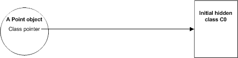
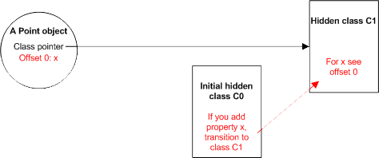
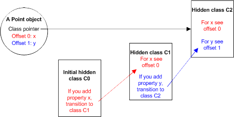
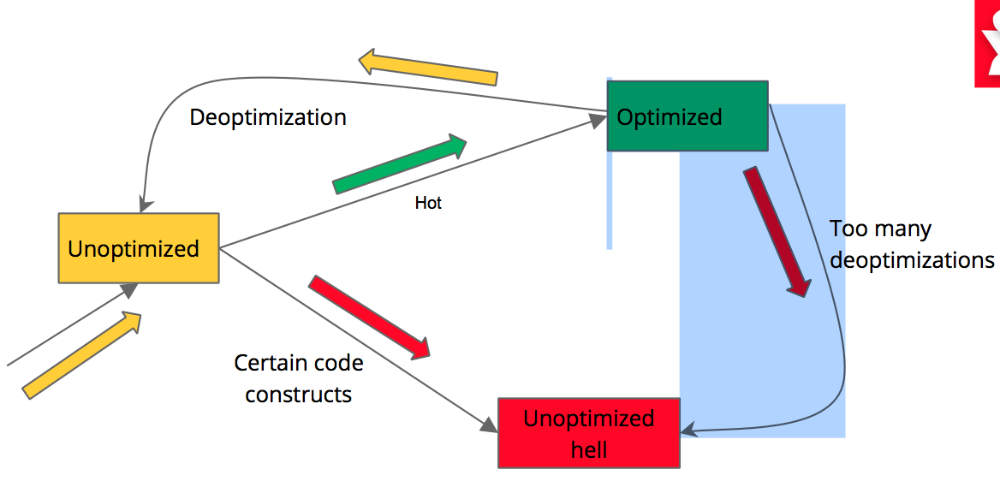
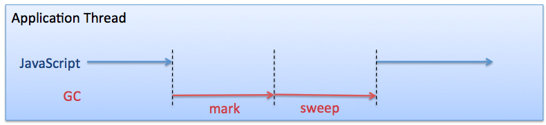
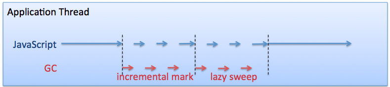
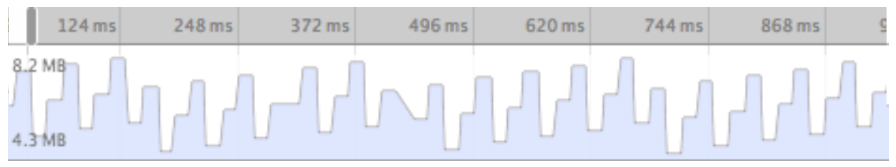
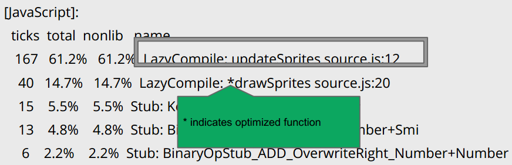
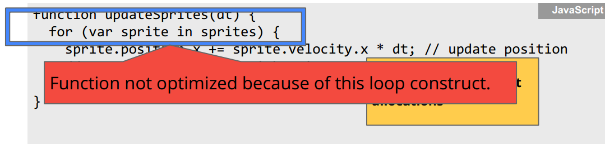
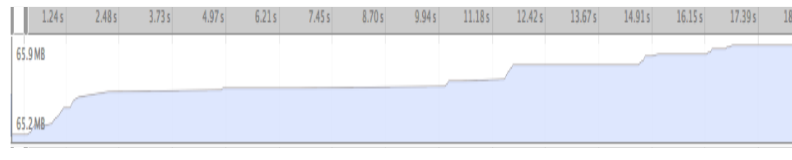

# node.js背后的引擎V8及优化技术

前一期朴灵曾介绍了node.js背后的V8引擎在内存管理方面的处理。本文将挖掘V8引擎在其它方面的代码优化，如何写出高性能的代码，及V8的性能诊断工具。V8是chrome背后的javascript引擎，因此本文的相关优化经验也适用于基于chrome浏览器的javascript引擎。

node.js的执行速度远超ruby、python等脚本语言，达到接近java与C的速度， 这背后都是V8引擎的功劳。(具体性能数据可能参考朴灵的《深入浅出node.js》)


## 一、V8背后的故事

### 1.1 javascript的速度与需求
 
JavaScript存在至少10年了。在1995年，它出现在网景(Netscape Communications)公司所研发的网页浏览器Netscape Navigator 2.0中。然而有段时间人们对于性能的要求不高，因为它只用在网页上少数的动画、交互操作或其它类似的动作上。(最明确的是为了减少网络传输，以提高效率和改善交互性！)浏览器的显示速度视网络传输速度以及渲染引擎（rendering engine）解析HTML、CSS（cascading style sheets, CSS）及其他代码的速度而定。浏览器的开发工作优先提升渲染引擎的速度，而JavaScript的处理速度不是太重要。同时出现的Java有相当大的进步，它被做得愈来愈快，以便和C++竞争。
 
然而，在过去几年，JavaScript突然受到广泛使用。原因是之前被当成桌面应用的软件（其中包括Office套件等），现已成为可以在浏览器中执行的软件。
 
Google本身就推出了好几款JavaScript网络应用，其中包括它的Gmail电子邮件服务、Google Maps地图数据服务、以及Google Docs office套件。
 
这些应用表现出的速度不仅受到服务器、网络、渲染引擎以及其他诸多因素的影响，同时也受到JavaScript本身执行速度的影响。然而既有的JavaScript引擎无法满足新的需求，而性能不佳一直是网络应用开发者最关心的。

Chrome团队意识到javascript引擎速度的重要性， 它们可以用现有的webkit引擎开发chrome， 但是javascript引擎必须重头开发, 他们需要虚拟机与语言的专家来解决这个问题，而这个专家就是Lars Bak。


### 1.2 Lars Bak（V8引擎创始人）出山

Lars Bak人首次在加州硅谷引起人们的注意是在1991年，那时他在Sun公司工作，后来成为业界最佳程序员之一。1994年，他离开Sun，帮助创建了Animorphic系统，该公司后来被Sun收购。再次回到Sun之后，Bak开发了后来成为Java HotSpot（行业标准计算系统之一）的主负责人。

可是2000年初，他却离开了计算机世界的核心，回到了丹麦，搬家是为了幸福生活，为了他的女儿们（他想让她们上丹麦语学校），为了自己的身心健康。美国的开发者社区工作很紧张，生活方式不健康。当巴克回到丹麦时，两个月之内他减了20斤（多亏了美国的阿式饮食疗法【Atkins diet】），而且再也没有反弹。

2002年，Bak在奥尔胡斯创建了一家名为OOVM的公司。2004年，他将公司卖给了一家瑞士公司Esmertec，然后又在该公司干了两年，帮助两个公司的融合。离开Esmertec时，他并不特别想找新项目：他有足够的钱养家糊口，也有各种打发时间的方式，包括粉刷农舍的计划。他估计得要一年时间。

然后Google的电话就来了。对于Google，巴克是不二选择——他编写了JavaScript引擎（Chrome的核心部分）。对于Bak，为Google工作就是 “小菜一碟”。“我不在乎当什么高级经理。我在乎的是推动技术边界。”Bak接受了这份工作，但不会回到加州。事实上他从没打算再次回加州——虽然谷歌的人性化办公室闻名远近，餐厅里的美食，还可以免费理发，Bak却宁可在家工作——离总部5000英里，相差9个时区。谷歌做好了“信任我的准备。他们知道我不会消磨时间。” Bak一开始在自己的农舍工作，后来搬到了奥尔胡斯的一座大学，google为他专门建立了研究院。

Lars Bak果然不负众望，chrome于2008年推出，V8引擎成为了世界上最快的javascript引擎。V8引擎是与chrome完全剥离的，它作为单独的开源项目在google code上开源。 Bak的原意是希望其它浏览器能够参考这个引擎的实现，使所有浏览的速度都上一个台阶。然而在2008年底，V8引擎引来一个意想不到的顾客。

### 1.3 Ryan Dahl（node.js创始人)的选择

Ryan Dahl就是这个意想不到的顾客。2004年的时候， Ryan Dahl还是纽约罗切斯特大学数学系的博士生， 似乎跟开发、开源社区没有任何。然而在2006年他做了一个意想不到的决定：退学，一个人拎着小包带着仅有的1000美元来到了智利的一个小镇Valparaiso。

当时他甚至都没想到糊口的办法，甚至想在智利教英语，但显然Ryan同学教英语教得并不顺，最后被带上了开发这条道路。从最初的ruby on rails应用开发变成了高性能web服务器的专家，Ryan只用了2年时间。他开始尝做开源项目来解决高并发web应用的问题，他尝试了各种语言ruby、lua、C，但所有这些都失败了。 只有用C写的http服务库libebb在变成了后来libuv的前身。

就在Ryan有点绝望的时候，V8引擎发布了，Ryan忽然灵光一闪，可以用javascript语言来实现高性能的web服务器。Ryan最后的开发成果就是node.js。2009年底当Ryan在柏林的jsconf eu演讲之后，node.js逐渐流行于世。

node.js让javascript语言成为了高并发服务端开发的重要语言，也让V8引擎的应用从浏览器移到了服务端。


## 二、V8的优化技术概述

V8引擎在虚拟机与语言性能优化上做了很多工作。不过按照Lars Bak的说法， 所有这些优化技术都是不他们创造的。这些技术都只是在前人的基础上做的改进。以下列一下V8的相关优化技术.

### 2.1 隐藏类（hidden class）

为了减少 JavaScript 中访问属性所花的时间，V8 采用了和动态查找完全不同的技术来实现属性的访问：动态地为对象创建隐藏类。这并不是什么新的想法，基于原型的编程语言 Self 就用 map 来实现了类似的功能（参见 An Efficient Implementation of Self, a Dynamically-Typed Object-Oriented Language Based on Prototypes ）。在 V8 里，当一个新的属性被添加到对象中时，对象所对应的隐藏类会随之改变。

下面我们用一个简单的 JavaScript 函数来加以说明：


```
function Point(x, y) {
    this.x = x;
    this.y = y;
}
```

当 new Point(x, y) 执行的时候，一个新的 Point 对象会被创建出来。如果这是 Point 对象第一次被创建，V8 会为它初始化一个隐藏类，不妨称作 C0。因为这个对象还没有定义任何属性，所以这个初始类是一个空类。到这个时候为止，对象 Point 的隐藏类是 C0。



执行函数 Point 中的第一条语句（this.x = x;）会为对象 Point 创建一个新的属性 x。此时，V8 会在 C0 的基础上创建另一个隐藏类 C1，并将属性 x 的信息添加到 C1 中：这个属性的值会被存储在距 Point 对象的偏移量为 0 的地方。
在 C0 中添加适当的类转移信息，使得当有另外的以其为隐藏类的对象在添加了属性 x 之后能够找到 C1 作为新的隐藏类。此时对象 Point 的隐藏类被更新为 C1。



执行函数 Point 中的第二条语句（this.y = y;）会添加一个新的属性 y 到对象 Point 中。同理，此时 V8 会：

在 C1 的基础上创建另一个隐藏类 C2，并在 C2 中添加关于属性 y 的信息：这个属性将被存储在内存中离 Point 对象的偏移量为 1 的地方。
在 C1 中添加适当的类转移信息，使得当有另外的以其为隐藏类的对象在添加了属性 y 之后能够找到 C2 作为新的隐藏类。此时对象 Point 的隐藏类被更新为 C2。



乍一看似乎每次添加一个属性都创建一个新的隐藏类非常低效。实际上，利用类转移信息，隐藏类可以被重用。下次创建一个 Point 对象的时候，就可以直接共享由最初那个 Point 对象所创建出来的隐藏类。例如，如果又一个 Point 对象被创建出来了：

一开始 Point 对象没有任何属性，它的隐藏类将会被设置为 C0。
当属性 x 被添加到对象中的时候，V8 通过 C0 到 C1 的类转移信息将对象的隐藏类更新为 C1 ，并直接将 x 的属性值写入到由 C1 所指定的位置（偏移量 0）。
当属性 y 被添加到对象中的时候，V8 又通过 C1 到 C2 的类转移信息将对象的隐藏类更新为 C2 ，并直接将 y 的属性值写入到由 C2 所指定的位置（偏移量 1）。
尽管 JavaScript 比通常的面向对象的编程语言都要更加动态一些，然而大部分的 JavaScript 程序都会表现出像上述描述的那样的运行时高度结构重用的行为特征来。使用隐藏类主要有两个好处：属性访问不再需要动态字典查找了；为 V8 使用经典的基于类的优化和内联缓存技术创造了条件。


### 2.2 内联缓存（incline cache）

在第一次执行到访问某个对象的属性的代码时，V8 会找出对象当前的隐藏类。同时，V8 会假设在相同代码段里的其他所有对象的属性访问都由这个隐藏类进行描述，并修改相应的内联代码让他们直接使用这个隐藏类。当 V8 预测正确的时候，属性值的存取仅需一条指令即可完成。如果预测失败了，V8 会再次修改内联代码并移除刚才加入的内联优化。

例如，访问一个 Point 对象的 x 属性的代码如下：

```
point.x
```

在 V8 中，对应生成的机器码如下：

```
ebx = the point object
cmp [ebx, <hidden class offset>], <cached hidden class>
jne <inline cache miss>
mov eax, [ebx, <cached x offset>]
```

如果对象的隐藏类和缓存的隐藏类不一样，执行会跳转到 V8 运行系统中处理内联缓存预测失败的地方，在那里原来的内联代码会被修改以移除相应的内联缓存优化。如果预测成功了，属性 x 的值会被直接读出来。

当有许多对象共享同一个隐藏类的时候，这样的实现方式下属性的访问速度可以接近大多数动态语言。使用内联缓存代码和隐藏类实现属性访问的方式和动态代码生成和优化的方式结合起来，让大部分 JavaScript 代码的运行效率得以大幅提升。

### 2.3 两次编译与反优化（Crankshaft） 

尽管JavaScript是个非常动态的语言，且原本的实现是解释性的，但现代的JavaScript运行时引擎都会进行编译。V8(Chrome的JavaScript)有两个不同的运行时(JIT)编译器：

* “完全”编译器（unoptimized）。一开始，所有的V8代码都运行在unoptimized状态。它的好处是编译速度非常快，它使代码初次执行速度非常快。
* “优化”编译器（optimized）。当V8发现某段代码执行非常热时，它会根据通常的执行路径进行代码优化，生成optimized代码。优化代码的执行速度非常快。

编译器有可能从“优化”状态退回到“完全”状态， 这就是deoptimized。这是很不幸的过程，优化后的代码没法正确执行，不得不退回到unoptimized版本。

当然最不幸的是代码不停地被optimized，然后又被deoptimized， 这会带来很大的性能损耗。以下是代码optimized与deoptimized执行流程：




### 2.4 高效垃圾收集

最初的V8引擎垃圾收集是不分代的，但目前V8引擎的GC机制几乎采用了与java hotspot完全相同的GC机制。对java虚拟机有经验的开发者直接套用， 对分代回收机制本文就不展开说了。

但是V8有一个重要的特性却是java没有的，而且是非常重要的特性，因此必须要提一下，这个特性叫incremental mark+lazy sweep。它的设计思路与java的CMS垃圾收集类似, 就是尽量减少GC系统停顿的时间。不过在V8里这是默认的GC方式，不象CMS需要非常复杂的配置，而且还可能有promotion fail引起的问题。

通常Full GC的mark sweep流程是这样的：



这个流程里每次GC都要完成完整的Mark, Sweep流程，因此停顿时间较久。

引入了increment mark之后的流程是这样的：


这个流程里每次GC可以在mark一半的时候停住，在完成业务逻辑后继续下一轮的GC，因此停顿时间较短。

只要保证node.js的内存大小不超过500M，V8即使发生full GC也能控制在50毫秒之内，这使node.js在开发高实时应用（如实时游戏）时比java语言更有优势。


## 三、编写对V8友好的高性能javascript代码

### 3.1 隐藏类(hidden class)的教训

* 在构造函数里初始化所有对象的成员(所以这些实例之后不会改变其隐藏类)
* 总是以相同的次序初始化对象成员
* 永远不要delete对象的某个属性

#### 3.1.1 示例1

```
function Point(x, y) {
  this.x = x;
  this.y = y;
}

var p1 = new Point(11, 22);
var p2 = new Point(33, 44);
// At this point, p1 and p2 have a shared hidden class
// 这里的p1和p2拥有共享的隐藏类
p2.z = 55;
// warning! p1 and p2 now have different hidden classes!
// 注意！这时p1和p2的隐藏类已经不同了！
```

在以上例子中p2.z破坏了上述原则， 将导致p1与p2使用了不同的隐藏类。

在我们为p2添加“z”这个成员之前，p1和p2一直共享相同的内部隐藏类——所以V8可以生成一段单独版本的优化汇编码，这段代码可以同时封装p1和p2的JavaScript代码。派生出这个新的隐藏类还将使编译器无法在optimized模式执行。我们越避免隐藏类的派生，就会获得越高的性能。


#### 3.1.2 示例2
```
function Point(x, y) {
  this.x = x;
  this.y = y;
}

for (var i=0; i<1000000; i++) {
  var p1 = new Point(11, 22);
  delete p1.x;
  p1.y++;
}
```
以上例子由于调用了delete，将导致hidden class产生变化，导致p1.y不能用inline cache直接获取。

以上程序在使用了delete之后耗时0.339s,在注释掉delete后只需0.05s。


### 3.2 deoptimized的教训 

* 单态操作优于多态操作
* 谨慎使用try catch与for in

#### 3.2.1 示例1

如果一个操作的输入总是相同类型的，则其为单态操作。否则，操作调用时的某个参数可以跨越不同的类型，那就是多态操作。比如add()的第二个调用就触发了多态操作：

```
function add(x, y) {
  return x + y;
}

add(1, 2);     // add中的+操作是单态操作
add("a", "b"); // add中的+操作变成了多态操作
```
以上示例由于传入的数据类型不同，使add操作编译成optimized代码。


#### 3.2.2 示例2

该示例来自google io 2013的一个演讲：[Accelerating Oz with V8: Follow the Yellow Brick Road to JavaScript Performance](https://developers.google.com/events/io/sessions/324908972)。

The oz story的游戏有频繁的GC，游戏的帧率在运行一段时间后不断下降，以下是gc曲线：



是什么导致如此GC呢？ 有三个疑犯：

* new出来的对象没有释放, 这通常由闭包或集合类的操作导致
* 对象在初始化后改变属性，就是hidden class示例1的例子
* 某段特别热的代码运行在deoptimized模式。

unit9的开发人员对js的开发规范了然于胸，绝对不会犯前两个错误，于是怀疑定在第3个嫌疑犯。这是诊断time后的结果：



上图的drawSprites运行在optimized状态，但updateSprites一直运行在deoptimized状态。

导致不断GC的原凶竟然是这几行代码：




因为for in下面的代码在V8下暂时无法优化。把for in内部的代码提出成单独的function， V8就可以优化这个function了。 这时GC和掉帧率的问题就立刻解决了。GC曲线出现了缓慢平缓的状态：



以上教训不仅仅是使用for in或try catch的问题,也许未来V8引擎会解决掉这两个问题。而是要理解怎么发现问题、解决问题，还有deoptimized竟然会对GC产生影响。

以上排查过程使用了--trace-opt, --trace-deopt， --prof命令选项，及mac-tick-processor等工具。
值得注意的是node.js里直接使用mac-tick-processor或linux-tick-processor是解不出javascript段执行结果的，可以使用[node-tick-processor](https://github.com/sidorares/node-tick)这个工具。


### 3.3 内存管理与GC的教训

在朴灵的《深入浅出node.js》这本书里有详细的V8内存管理和使用经验的介绍，推荐阅读。这里只做两个简单例子的介绍。

#### 3.3.1 闭包

闭包会使程序逻辑变复杂，有时会看不清楚是否对象内存被释放，因此要注意释放闭包中的大对象， 否则会引起内存泄露。 

例如以下代码：

```
var a = function () {
    var largeStr = new Array(1000000).join('x');
    return function () {
        return largeStr;
    };
}();
```

例子中的largeStr会被收集吗？当然不会， 因为通过全局的a()就可以取到largeStr。

那么下代码呢？

```
var a = function () {
    var smallStr = 'x';
    var largeStr = new Array(1000000).join('x');
    return function (n) {
        return smallStr;
    };
}();
```

这次a()了到的结果是smallStr，而largeStr则不能通过全局变量获得，因此largeStr可被收集。

#### 3.3.2 timer

timer的内存泄漏很普遍，也较难被发现。例如以下例子：

```
var myObj = {
    callMeMaybe: function () {
        var myRef = this;
        var val = setTimeout(function () { 
            console.log('Time is running out!'); 
            myRef.callMeMaybe();
        }, 1000);
    }
};
```

当你调用如下代码：

```
myObj.callMeMaybe();
```

定时器会不停打印"Time is running out"。

当你用如下代码释放掉myObj：

```
myObj=null;
```
定时器仍然会不停打印"Time is running out"。 

myObj对象不会被释放掉，因为内部的myRef对象也指向了myObj， 而内部的setTimeout调用使会将闭包加到node.js事件循环的队列里，因此myRef对象不会释放。


### 3.4 其它教训 

#### 3.4.1 使用数字的教训


当类型可以改变时，V8使用标记来高效的标识其值。V8通过其值来推断你会以什么类型的数字来对待它。因为这些类型可以动态改变，所以一旦V8完成了推断，就会通过标记高效完成值的标识。不过有的时候改变类型标记还是比较消耗性能的，我们最好保持数字的类型始终不变。通常标识为有符号的31位整数是最优的。

以下是整数在内存中的表示方法：

```
var i = 42; // 这是一个31位有符号整数
```


以下是双精度浮点数在内存中的表示方法：

```
var j = 123.45; // 这是一个双精度浮点数
```


结论：

* 尽量使用可以用31位有符号整数表示的数


#### 使用Array的教训

为了掌控大而稀疏的数组，V8内部有两种数组存储方式：

* 快速元素：对于紧凑型关键字集合，进行线性存储
* 字典元素：对于其它情况，使用哈希表

最好别导致数组存储方式在两者之间切换。

因此：

* 使用从0开始连续的数组关键字
* 别预分配大数组(比如大于64K个元素)到其最大尺寸，令其尺寸顺其自然发展就好
* 别删除数组里的元素，尤其是数字数组
* 别加载未初始化或已删除的元素：
　
##### 示例1

```
a = new Array();
for (var b = 0; b < 10; b++) {
  a[0] |= b;  // 杯具！
}
```

```
a = new Array();
a[0] = 0;
for (var b = 0; b < 10; b++) {
  a[0] |= b;  // 比上面快2倍
}
```

以上两段代码，由于第一段代码的a[0]未初始化， 尽管执行结果正确，但会导致执行效率的大幅下降。


##### 示例2
同样的，双精度数组会更快——数组的隐藏类会根据元素类型而定，而只包含双精度的数组会被拆箱(unbox)，这导致隐藏类的变化。对数组不经意的封装就可能因为装箱/拆箱(boxing/unboxing)而导致额外的开销。比如：

```
var a = new Array();
a[0] = 77; // 分配
a[1] = 88;
a[2] = 0.5; // 分配，转换
a[3] = true; // 分配，转换
```
因为第一个例子是一个一个分配赋值的，在对a[0] a[1]赋值时数组被判定为整型数组，但对a[2]的赋值导致数组被拆箱为了双精度。但是对a[3]的赋值又将数组重新装箱回了任意值(数字或对象)。

下面的写法效率更高：

```
var a = [77, 88, 0.5, true];
```

第二种写法时，编译器一次性知道了所有元素的字面上的类型，隐藏隐藏类可以直接确定。

因此：

* 初始化小额定长数组时，用字面量进行初始化
* 小数组(小于64k)在使用之前先预分配正确的尺寸
* 请勿在数字数组中存放非数字的值(对象)
* 如果通过非字面量进行初始化小数组时，切勿触发类型的重新转换


## 四、结论

google V8使javascript语言的执行效率上了一大台阶。但是javascript语言是非常灵活的语言，过于灵活的语法将导致不规范的javascript语言无法优化。
因此在编写对V8编译器友好的javascript或node.js语言时就要格外注意。


